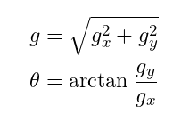

# 📊 Histogram of Oriented Gradients (HOG)

## ✅ Giới thiệu

**HOG (Histogram of Oriented Gradients)** là một kỹ thuật mô tả đặc trưng (feature descriptor) trong thị giác máy tính, được sử dụng rộng rãi trong các bài toán như:
- Phát hiện người (pedestrian detection)
- Nhận dạng đối tượng
- Phát hiện xe, khuôn mặt, và các đối tượng khác

HOG được đề xuất bởi **Navneet Dalal và Bill Triggs** năm 2005 và đã trở thành nền tảng trong nhiều hệ thống thị giác hiện đại.

---

## 🧠 Ý tưởng chính

HOG khai thác **phân bố của gradient (biến thiên cường độ pixel)** theo hướng trong các vùng nhỏ (cell) của ảnh.

Các bước chính:

1. **Tiền xử lý ảnh** (chuyển về grayscale, resize...)
2. **Tính gradient theo x, y** để lấy hướng và độ lớn.
3. **Chia ảnh thành các vùng nhỏ (cells)**.
4. **Tính histogram hướng gradient** cho mỗi cell.
5. **Chuẩn hóa theo block** (gồm nhiều cell) để giảm nhạy cảm với ánh sáng.
6. **Ghép các vector đặc trưng** thành vector đặc trưng cuối cùng.

---

## 🔧 Các thành phần kỹ thuật

| Thành phần         | Mô tả                                                                 |
|--------------------|-----------------------------------------------------------------------|
| **Gradient**       | Tính theo đạo hàm ảnh: \( G_x, G_y \) và \( \theta = \tan^{-1}(G_y/G_x) \) |
| **Cell**           | Vùng nhỏ thường là \(8 \times 8\) pixels                              |
| **Histogram**      | Phân bố hướng gradient thành các bin (ví dụ: 9 bins ứng với 0–180°)    |
| **Block**          | Nhóm các cell liền kề để chuẩn hóa (thường là \(2 \times 2\) cell)     |
| **Normalization**  | Sử dụng L2-norm để chuẩn hóa vector histogram                         |

---

## 🖼️ Minh họa trực quan

Ảnh: Trích xuất đặc trưng HOG từ ảnh người bằng OpenCV

---

## 🧪 Ứng dụng thực tế

- 🚶 **Phát hiện người** (ứng dụng nổi tiếng với SVM + HOG)
- 🚗 **Phát hiện xe**
- 📷 **Nhận dạng hành vi và tư thế**
- 🧠 **Làm đặc trưng đầu vào cho các thuật toán học máy**

---

## 💡 Ưu điểm và Nhược điểm

### Ưu điểm:
- Đơn giản, hiệu quả
- Ổn định với thay đổi ánh sáng nhỏ
- Dễ tích hợp với SVM hoặc các thuật toán học máy truyền thống

### Nhược điểm:
- Không mô tả tốt các đặc trưng phức tạp như texture
- Không học được đặc trưng như CNN

---

## 📚 Tài liệu tham khảo

- [Dalal & Triggs, 2005 - Original Paper (CVPR)](https://lear.inrialpes.fr/people/triggs/pubs/Dalal-cvpr05.pdf)
- OpenCV HOG: `cv2.HOGDescriptor`
- [Scikit-image: hog() function](https://scikit-image.org/docs/stable/auto_examples/features_detection/plot_hog.html)

---

### Tính được Gradient bao gồm hai thành phần cường độ(Gradient Magnitude) và hướng(Gradient Derection) theo công thức:
